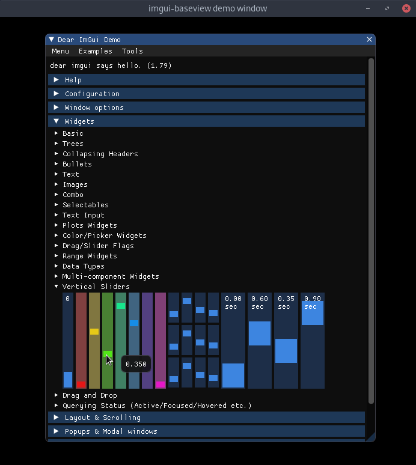

# imgui-baseview

[](https://crates.io/crates/imgui-baseview)
[](https://github.com/BillyDM/imgui-baseview/blob/main/LICENSE)

A [`baseview`] backend for [`imgui-rs`].

<div align="center">
    
</div>

## Simple Usage Example

```rust
use imgui::{im_str, Condition, Ui, Window};
use imgui_baseview::{
    settings, HiDpiMode, Parent, RenderSettings, Runner,
    Settings, WindowScalePolicy,
};

fn main() {
    let settings = Settings {
        window: settings::Window {
            title: String::from("imgui-baseview hello world"),
            logical_size: (300, 110),
            scale_policy: WindowScalePolicy::SystemScaleFactor,
        },
        clear_color: (0.0, 0.0, 0.0),
        hidpi_mode: HiDpiMode::Default,
        render_settings: RenderSettings::default(),
    };

    let state = ();

    let (_, opt_app_runner) = Runner::open(
        settings,
        Parent::None,
        state,
        move |run: &mut bool, ui: &Ui, _state: &mut ()| {
            Window::new(im_str!("Hello world"))
                .opened(run)
                .size([300.0, 110.0], Condition::FirstUseEver)
                .position([0.0, 0.0], Condition::FirstUseEver)
                .build(ui, || {
                    ui.text(im_str!("Hello world!"));
                    ui.text(im_str!("こんにちは世界！"));
                    ui.text(im_str!("This...is...imgui-rs!"));
                    ui.separator();
                    let mouse_pos = ui.io().mouse_pos;
                    ui.text(format!(
                        "Mouse Position: ({:.1},{:.1})",
                        mouse_pos[0], mouse_pos[1]
                    ));
                });
        },
    );

    opt_app_runner.unwrap().app_run_blocking();
}
```

[`baseview`]: https://github.com/RustAudio/baseview
[`imgui-rs`]: https://github.com/imgui-rs/imgui-rs
